# Corona-Cases-Prediction-Deployment

     

• This repository consists of files required to deploy a ___Machine Learning Web App___ created with ___Django___ on ___Heroku___ platform.

• If you want to view the deployed model, click on the following link: 
Deployed at: __

• Please do ⭐ the repository, if it helped you in anyway.

• A glimpse of the web app:

_**1] HOME PAGE-1 :**_ 
• Novel CoronaVirus Predictor Web Application.

1. Top View.

 

_**2] HOME PAGE-2 :**_ 

2. Middle View.

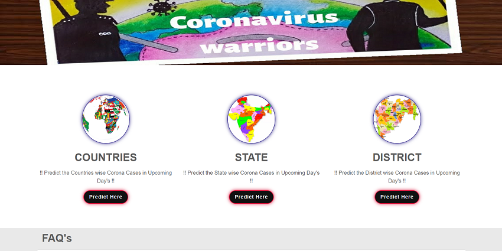

_**3] HOME PAGE-3 :**_ 

3. Bottom View.

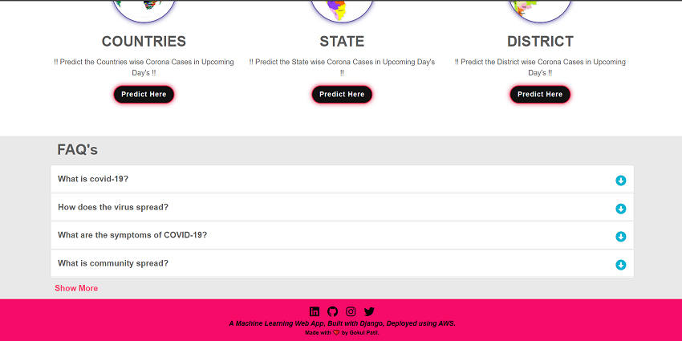

_**4] FOR COUNTRIES :**_ 
• Predict the Covid-19 cases in upcoming day for countries.

1. Confiremed Cases.
2. Active Cases.
3. Recovered Cases.
4. Death Cases.

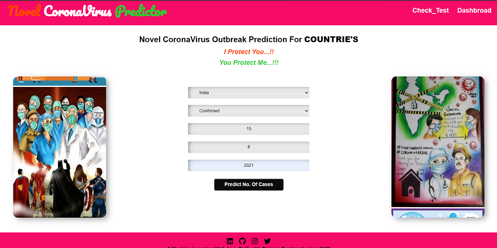

_**Results Page For Countries :**_

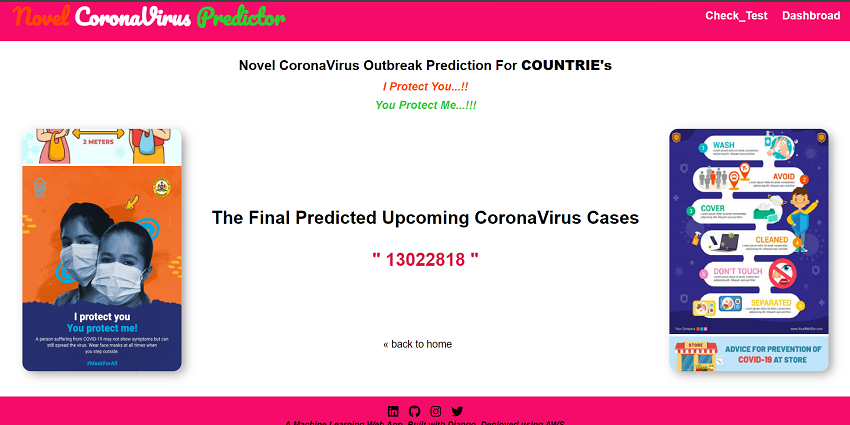

_**5] FOR STATE :**_ 
• Predict the Covid-19 cases in upcoming day for State.

1. Active Cases.
2. Recovered Cases.
3. Death Cases.

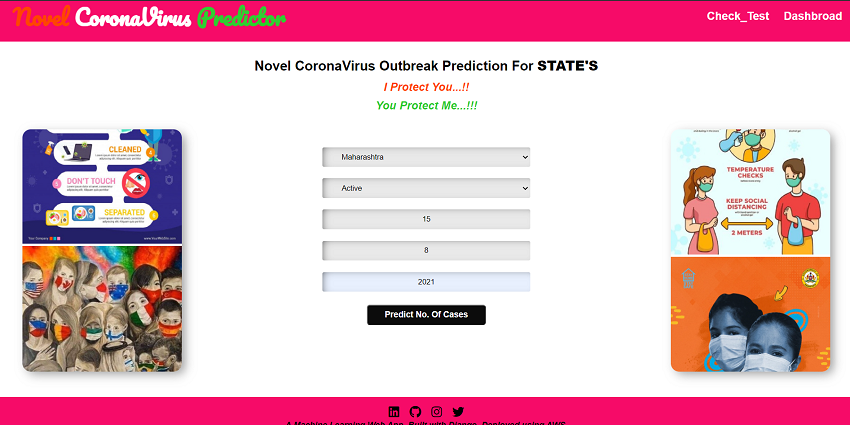

_**Results Page For State :**_

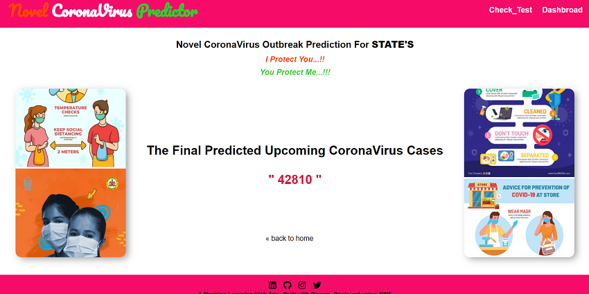

_**6] FOR DISTRICT :**_ 
• Predict the Covid-19 cases in upcoming day for District.

1. Active Cases.
2. Recovered Cases.
3. Death Cases.

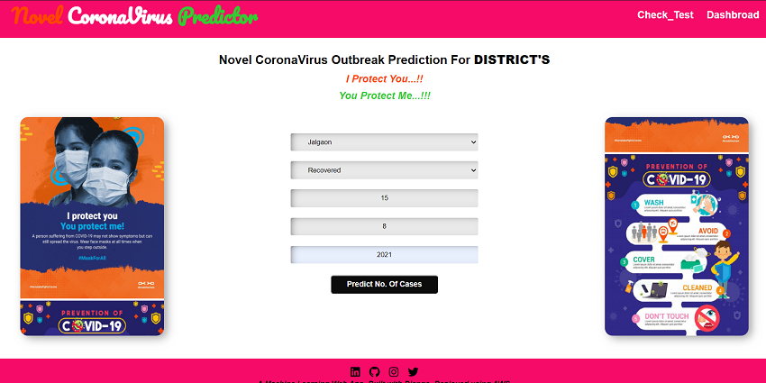

_**Results Page For District :**_

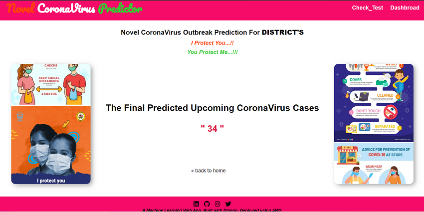

_**7] FREQUENTLY ASKED QUESTION'S :**_ 
1. Top View.

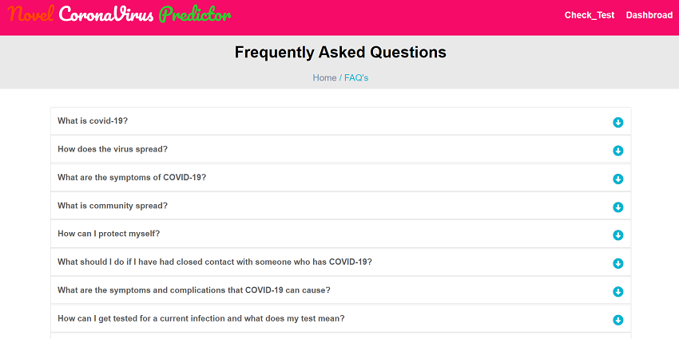

2. Bottom View.

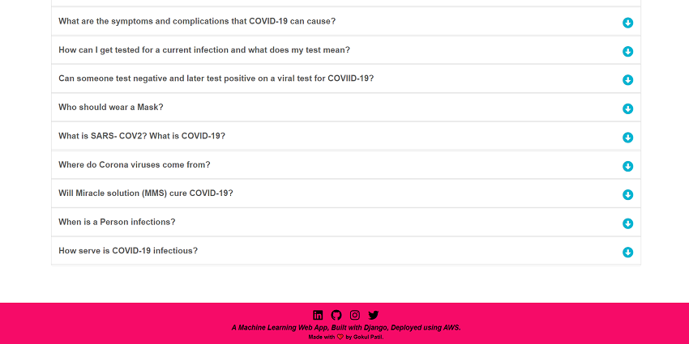

_**8] FOR TEST CORONA VIRUS :**_ 
• Predict whether a patient is infected with the corona virus based on the symptoms.

_**1. SAFE :**_

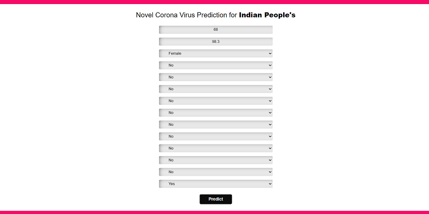

_**Results Page For Safe :**_

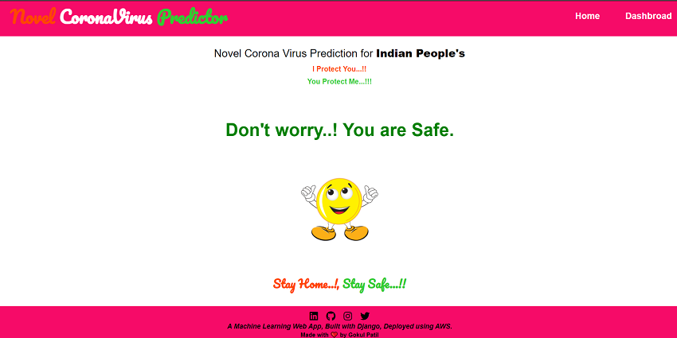

_**2. SYMPTOMS OF CORONA VIRUS :**_

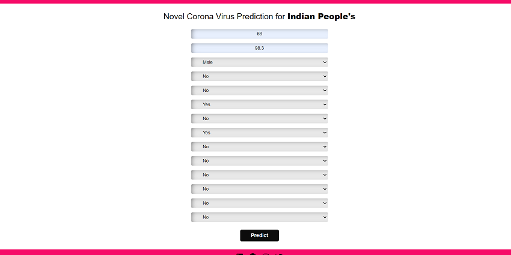

_**Results Page For Symptoms of corona virus :**_

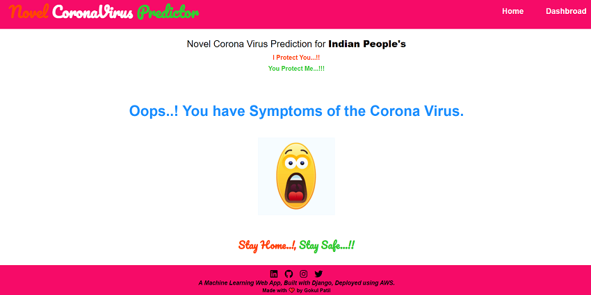

_**2. INFECTED WITH CORONA VIRUS :**_

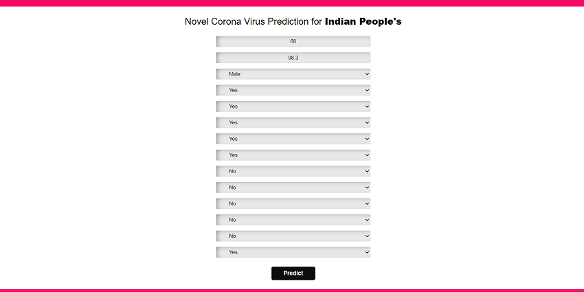

_**Results Page For Infected with corona virus :**_

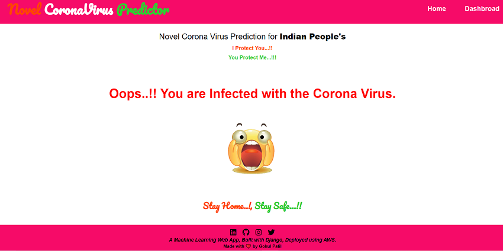

 
