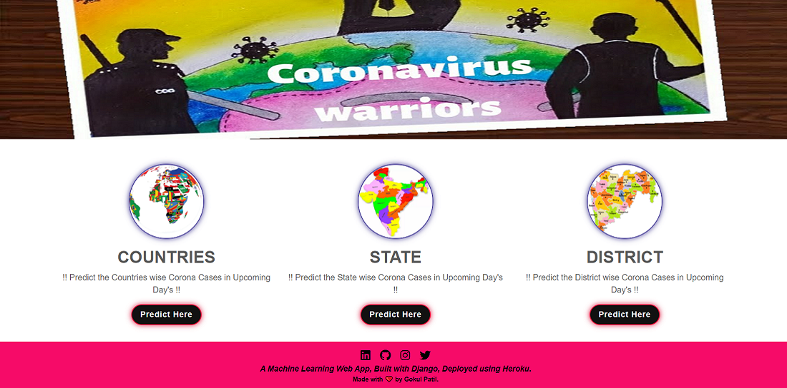
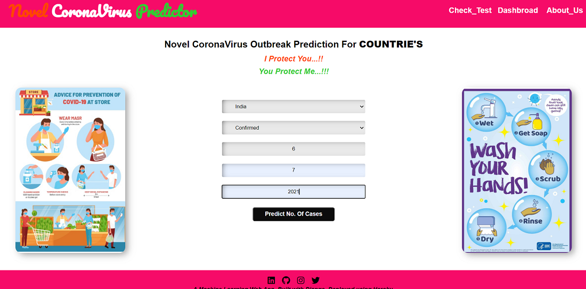
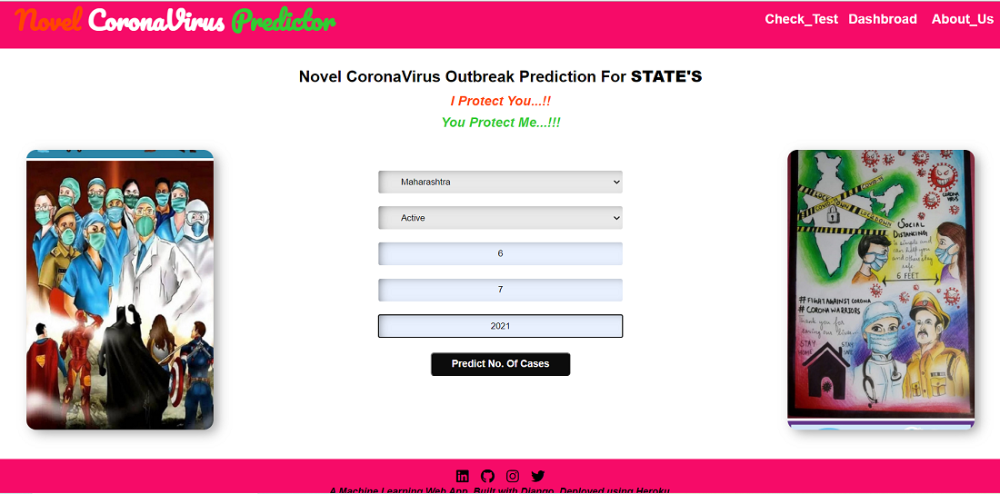
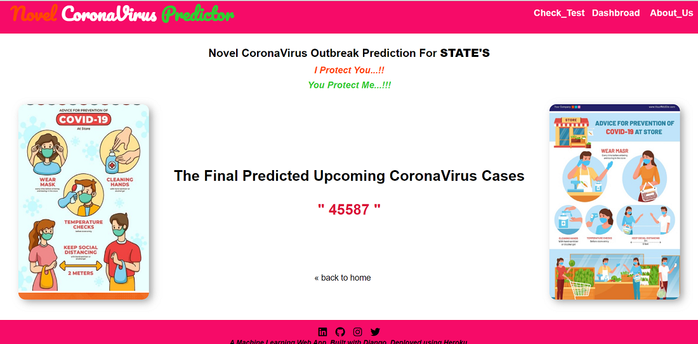
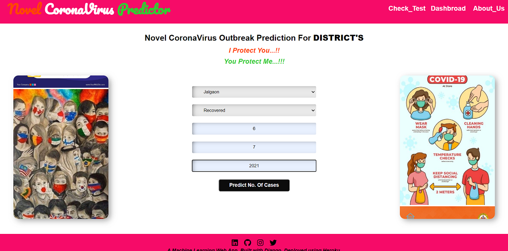
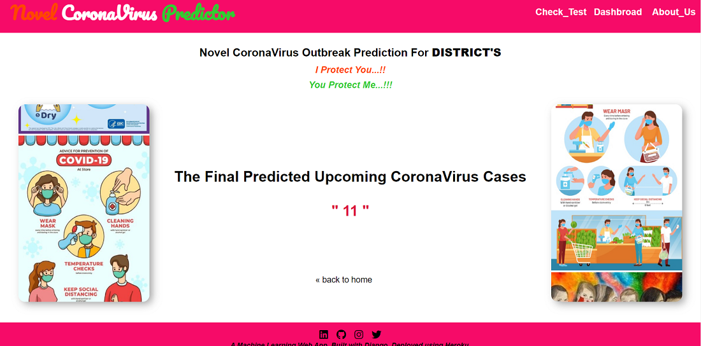

# Corona-Cases-Prediction-Deployment

     

• This repository consists of files required to deploy a ___Machine Learning Web App___ created with ___Django___ on ___Heroku___ platform.

• If you want to view the deployed model, click on the following link: 
Deployed at: __

• Please do ⭐ the repository, if it helped you in anyway.

• A glimpse of the web app:

_**----- HOME PAGE-1 -----**_ 

 

_**----- HOME PAGE-2 -----**_ 

_**----- FOR COUNTRIES -----**_ 
• Home Page For Countries

• Results Page For Countries

_**----- FOR STATE -----**_ 
• Home Page For State

• Results Page For State

_**----- FOR DISTRICT -----**_ 
• Home Page For District

• Results Page For District

_**----- FOR TEST CORONA VIRUS -----**_ 

 
